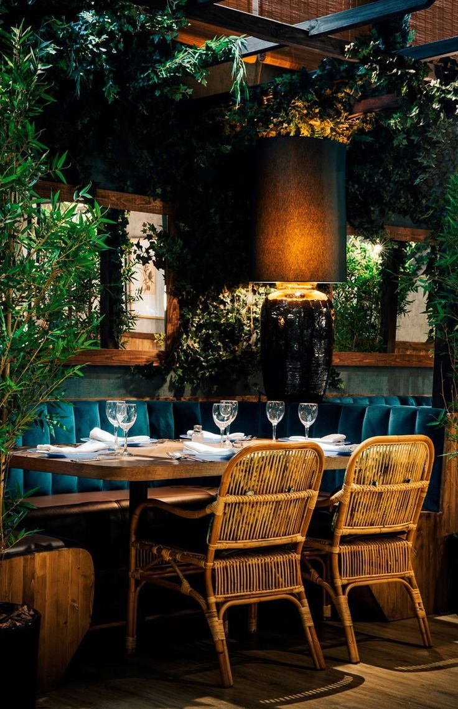
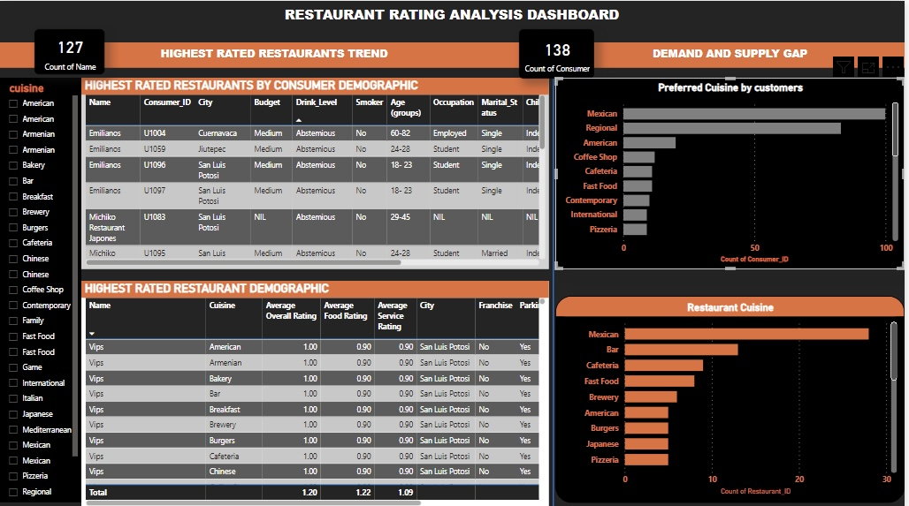

# Restaurant Rating

## Overview
A customer survey was carried out in this city in 2012 to collate information about each restaurant, their cuisines, information about their consumers and the preferences of the consumers.

## Problem statement
### Question 1.
What can you learn from the highest rated restaurants? Do consumer preferences have an effect on ratings?

### Question 2.
What are the consumer demographics? Does this indicate a bias in the data sample?

### Question 3.
Are there any demand & supply gaps that you can exploit in the market?

### Question 4.
If you were to invest in a restaurant, which characteristics would you be looking for?

## Data Source
The analysis draws insights from five primary datasets: 'consumer_preferences.csv', 'consumers.csv', 'ratings.csv', 'restaurant_cuisines.csv', and 'restaurants.csv'. Additionally, the 'data-dictionary.csv' serves as a reference for understanding the variables and their definitions. These datasets collectively provide comprehensive information about both consumers and restaurants.

The 'consumers.csv' dataset contains detailed profiles of individual consumers, including demographic information such as age, marital status, and location. On the other hand, the 'consumer_preferences.csv' dataset delves into consumer preferences, offering insights into their preferred cuisines.

For restaurants, the 'restaurants.csv' dataset provides comprehensive information about each establishment, including location, services offered (such as parking availability and alcohol service), and customer ratings. The 'restaurant_cuisines.csv' dataset complements this by detailing the cuisines offered by each restaurant.

Furthermore, the 'ratings.csv' dataset presents an evaluation of various restaurant characteristics, reflecting consumers' experiences and satisfaction levels. This rich array of data allows for a thorough analysis of both consumer preferences and restaurant performance, enabling informed decision-making and strategic planning.

## Data Analysis Process

The data analysis for this project involved the utilization of various tools and skills to extract meaningful insights. Here's an overview of the tools and skills employed:

1. *Excel:* Excel was used for data cleaning, manipulation, and basic analysis tasks such as filtering, sorting, and conditional formatting. It provided a familiar interface for initial data exploration and preparation.

2. *Power BI:* Power BI was utilized for more advanced data analysis and visualization. This powerful business analytics tool allowed for the creation of interactive dashboards, data modeling, and the generation of insightful visualizations.

3. *DAX (Data Analysis Expressions):* DAX was employed within Power BI for creating calculated columns, measures, and complex calculations. It facilitated the manipulation and aggregation of data to derive key metrics and performance indicators.

4. *Data Cleaning and Preprocessing:* Skills in data cleaning and preprocessing were essential for ensuring the accuracy and consistency of the dataset. Tasks such as removing duplicates, handling missing values, and standardizing data formats were performed to prepare the data for analysis.

5. *Data Visualization:* Proficiency in data visualization techniques was crucial for presenting insights effectively. This involved selecting appropriate chart types, designing intuitive dashboards, and using visual elements to communicate findings clearly.

6. *Statistical Analysis:* Basic statistical analysis skills were applied to interpret numerical data and uncover patterns or trends. Descriptive statistics such as averages, frequencies, and percentages were calculated to summarize key aspects of the dataset.

Overall, a combination of technical skills in data manipulation and visualization, along with domain knowledge and critical thinking, were instrumental in conducting a comprehensive data analysis for the project.

## Data Modelling

## Visualization

[click here](https://github.com/AmaPrecious/Restaurant_rating/blob/main/Restuarant%20rating%20consumers%20demographics.pbix) for the **Power Bi** dashboard.

 

1. There are 130 restaurants and 138 customers included in the analysis.
2. Age groups were categorized into four ranges: 18-23, 24-28, 29-45, and 60-82.
3. Singles account for 89.86% of the customers, while married individuals make up 7.25%.
4. Transportation methods used by customers: Public transport (82), car (35), on foot (14), none specified (7).
5. Occupations: Students (113), employed (16), unspecified (7), unemployed (2).
6. Budget categories: Medium budget students (71), low budget students (35), high budget students (1), no specified budget for employed individuals.
7. Customers without children comprise 81.88% of the total, while those with children represent 7.97%.
8.  The most preferred cuisine among customers is Mexican, with 97 mentions.

These insights provide valuable information about the demographic and preference characteristics of the customers. 

Emilianos is a highly-rated restaurant known for its diverse cuisine offerings and excellent customer satisfaction. The analysis reveals that the restaurant attracts a clientele with varying characteristics and preferences.

1. **Customer Demographics:**
   - Emilianos primarily caters to customers with a medium budget, indicating that it offers a dining experience that is perceived as providing good value for money.
   - The majority of customers are abstemious when it comes to drinking and are non-smokers, suggesting a preference for a healthy lifestyle or a focus on enjoying the food rather than alcohol.
   - The restaurant is particularly popular among students, who likely appreciate the affordable options and casual ambiance.
   - The fact that most customers are single and do not bring children indicates that Emilianos may appeal more to young adults or couples seeking a relaxed dining experience without family obligations.

2. **Customer Preferences and Satisfaction:**
   - Emilianos receives high overall satisfaction ratings from its customers, with many describing their experience as "very satisfied." This suggests that the restaurant excels in delivering quality food, service, and ambiance.
   - The variety of cuisines offered, including Mexican, American, Armenian, bakery items, and beverages like beer and wine, caters to a diverse range of tastes and preferences.
   - Despite its popularity, the restaurant faces challenges such as limited parking space and a no-smoking policy, which may inconvenience some customers.

3. **Market Demand and Supply:**
   - Mexican cuisine emerges as the most preferred option among consumers, with 100 individuals expressing interest in it.
   - However, the supply of Mexican cuisine is relatively limited, with only 28 restaurants offering it. This creates a significant demand-supply gap that Emilianos could capitalize on by further emphasizing its Mexican menu offerings and potentially expanding its variety in this category.

Overall, the analysis highlights Emilianos' strengths in customer satisfaction and diverse cuisine options while also identifying areas for improvement, such as addressing parking constraints and potentially enhancing its Mexican cuisine offerings to meet the high demand in the market. By leveraging these insights, Emilianos can refine its strategies to attract more customers and enhance its competitive position in the restaurant industry.

## Conclusion and Recommendation

The analysis of the restaurant industry dataset provides valuable insights into customer preferences, restaurant characteristics, and market dynamics. Key findings include:

- Emilianos, Michiko Restaurant, and Happiness Restaurant Las Mananitas emerged as the highest-rated restaurants, known for their diverse cuisine offerings and high levels of customer satisfaction.
- Emilianos, in particular, caters to a diverse customer base, primarily comprising students with medium budgets who prefer Mexican cuisine. Despite its popularity, the restaurant faces challenges such as limited parking and a no-smoking policy.
- Mexican cuisine stands out as the most preferred option among consumers, indicating a significant demand for this cuisine in the market.

*Recommendations:*
Based on the analysis, the following recommendations are proposed for stakeholders in the restaurant industry:

1. *Enhance Mexican Cuisine Offerings:* Emilianos and other restaurants should capitalize on the high demand for Mexican cuisine by expanding their menu options in this category. This could involve introducing new Mexican dishes, promoting Mexican-themed events, or collaborating with local chefs to innovate and attract more customers.

2. *Address Operational Challenges:* Restaurants like Emilianos should address operational challenges such as limited parking space and smoking policies to improve the overall customer experience. Implementing solutions like valet parking services or designated smoking areas could help alleviate these issues and enhance customer satisfaction.

3. *Diversify Marketing Strategies:* Restaurants should diversify their marketing strategies to reach a broader audience and promote their unique offerings. This could involve leveraging social media platforms, collaborating with influencers or food bloggers, and participating in community events to increase visibility and attract new customers.

4. *Invest in Customer Feedback:* Establishing robust feedback mechanisms, such as customer surveys or online review platforms, can provide valuable insights into customer preferences and satisfaction levels. Restaurants should actively solicit feedback from customers and use this information to make data-driven decisions and continuously improve their offerings.

By implementing these recommendations, restaurants can better align their offerings with customer preferences, improve operational efficiency, and ultimately enhance their competitive advantage in the dynamic restaurant industry.
